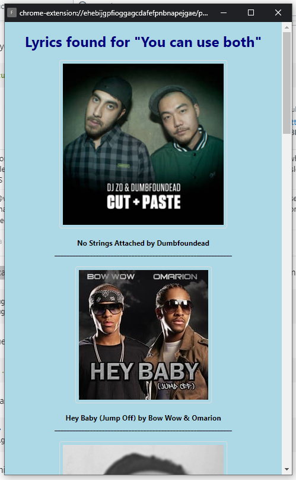

# Find My Lyrics
A Chrome extension that finds songs matching highlighted text.
The lyrics are found using the Genius API.

## How to Use
Make a text selection and use the "Find selected lyrics" option in the right-click context menu.

## How to Install
1. Download the repository as a zip and unzip it
2. Go to [Genius's API page](https://genius.com/api-clients), register an account, and generate a client access token
3. In popup.js edit the 'CLIENT_TOKEN' variable with the newly generated token
4. Load unpack it into the extensions page of Chrome (must have developer mode enabled)
